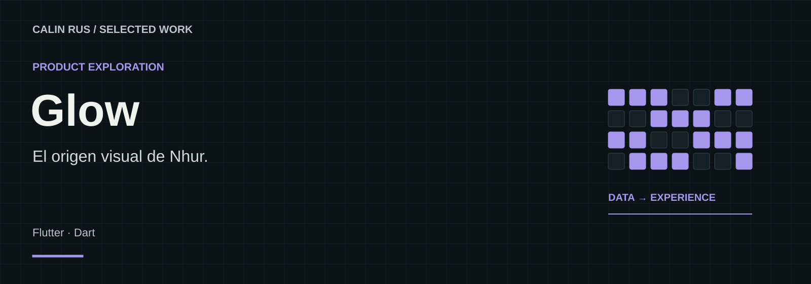

# Glow

**El origen visual de Nhur.**

Glow fue el nombre anterior del proyecto social que evoluciona como Nhur. Este caso conserva la exploración de comunidades e identidad contextual, mientras Glow continúa dentro de Nhur como parte de su estética y lenguaje visual.

**Stack:** Flutter · Dart  
**Estado:** Origen de Nhur · Identidad visual integrada

[Portfolio](https://github.com/calinrus-dev/portfolio) · [Experiencia](docs/EXPERIENCIA.md) · [Componentes](docs/COMPONENTES.md) · [Diseño técnico](docs/ARQUITECTURA.md) · [Demostraciones](docs/DEMOSTRACIONES.md) · [Estado](docs/ESTADO.md)

## El problema que aborda

La misma persona se expresa de maneras distintas según el lugar y la conversación. Glow exploró cómo trasladar esa idea a la estructura y a la apariencia de una plataforma social.

## Qué compone la experiencia

- **Descubrimiento.** Un acceso global a lugares y contenido.
- **Espacios temáticos.** Estructuras con apariencia y reglas propias.
- **Identidad contextual.** Presentación del usuario adaptada al lugar.
- **Contenido modular.** Composición visual de entradas con diferentes bloques.

*Lámina explicativa con datos ficticios. Su contenido también está disponible como texto en [Componentes](docs/COMPONENTES.md).*

## Decisiones que definen el proyecto

- **El lugar cambia la experiencia.** La interfaz aporta señales de pertenencia y contexto.
- **La identidad tiene capas.** Un espacio temático puede necesitar una presencia distinta de la global.
- **Historia visible.** Este proyecto se presenta como antecedente, no como duplicado de un servicio actual.

## Explorar el caso

- [Experiencia y recorrido](docs/EXPERIENCIA.md): intención, interacción y criterios de revisión.
- [Componentes](docs/COMPONENTES.md): las piezas visibles y el papel de cada una.
- [Diseño técnico](docs/ARQUITECTURA.md): responsabilidades y compromisos de diseño.
- [Demostraciones](docs/DEMOSTRACIONES.md): qué enseñan las imágenes y cómo leer la evidencia.
- [Estado y siguientes pasos](docs/ESTADO.md): alcance actual, comprobaciones y trabajo pendiente.

## Sobre este repositorio

Caso de estudio público de un proyecto con implementación privada. Reúne documentación, diagramas e imágenes seleccionadas. Los detalles del motor, integraciones, datos operativos y código se mantienen en los repositorios privados.

Revisión editorial: 28 de septiembre de 2026. Autor: [Calin Rus](https://github.com/calinrus-dev).

[calinrus.com](https://calinrus.com) · [Instagram @c4linrus](https://www.instagram.com/c4linrus/) · [Todos los proyectos](https://github.com/calinrus-dev/portfolio)
