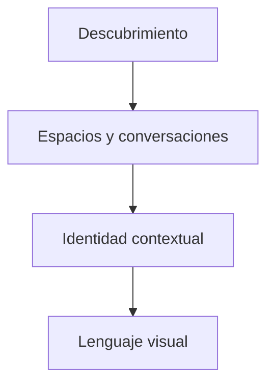

# Glow / Diseño técnico

[← Inicio](../README.md)

## Contexto

Glow fue el nombre anterior del proyecto social que evoluciona como Nhur. Este caso conserva la exploración de comunidades e identidad contextual, mientras Glow continúa dentro de Nhur como parte de su estética y lenguaje visual.

**Tecnologías asociadas al proyecto:** Flutter · Dart.

## Mapa de responsabilidades

Este mapa conceptual organiza la explicación del producto; no representa endpoints, procesos desplegados ni contratos internos.

## El lugar cambia la experiencia

La interfaz aporta señales de pertenencia y contexto.

## La identidad tiene capas

Un espacio temático puede necesitar una presencia distinta de la global.

## Historia visible

Este proyecto se presenta como antecedente, no como duplicado de un servicio actual.

## Rendimiento y dependencia

Mi criterio de trabajo es medir antes de optimizar: identificar el recorrido relevante, observar tiempo de respuesta y uso de recursos y comparar cambios con la misma carga. En sistemas nativos también me interesa la disposición de datos, la localidad de memoria y el trabajo repetido.

Local-first es una preferencia arquitectónica: conservar una experiencia útil y control sobre los datos en el dispositivo, e incorporar servicios externos cuando aporten una función concreta. Su alcance varía por proyecto; no implica que todas las integraciones de este caso funcionen sin conexión.

No se publican cifras de rendimiento sin un ensayo identificado. La evidencia específica disponible está en [Estado](ESTADO.md).

## Qué conviene demostrar después

- Conservar las decisiones de diseño que siguen siendo útiles.
- Documentar la evolución del lenguaje de producto.
- Conectar el archivo histórico con el desarrollo actual de Nhur.
