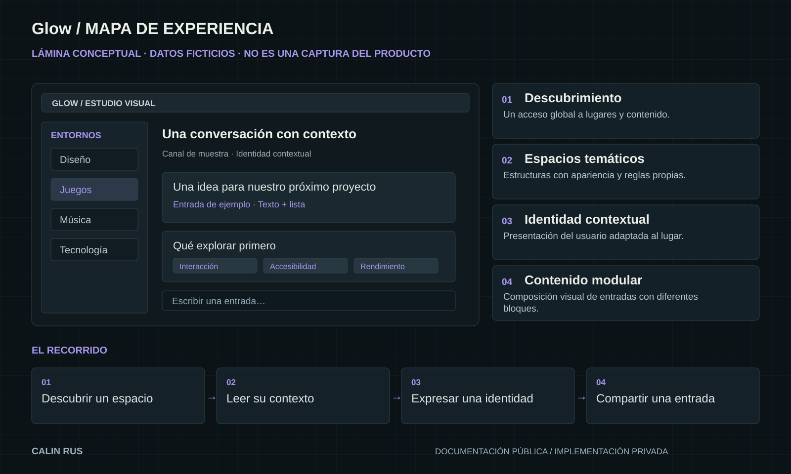

# Glow / Componentes de producto

[← Inicio](../README.md)

Lámina conceptual con contenido ficticio. Las piezas de esta página describen la experiencia y sus responsabilidades visibles.

## 01 / Descubrimiento

Un acceso global a lugares y contenido.

**En el recorrido:** Descubrir un espacio.

**Responsabilidad relacionada:** Descubrimiento.

## 02 / Espacios temáticos

Estructuras con apariencia y reglas propias.

**En el recorrido:** Leer su contexto.

**Responsabilidad relacionada:** Espacios y conversaciones.

## 03 / Identidad contextual

Presentación del usuario adaptada al lugar.

**En el recorrido:** Expresar una identidad.

**Responsabilidad relacionada:** Identidad contextual.

## 04 / Contenido modular

Composición visual de entradas con diferentes bloques.

**En el recorrido:** Compartir una entrada.

**Responsabilidad relacionada:** Lenguaje visual.

## Relación entre las piezas

Descubrir un espacio → Leer su contexto → Expresar una identidad → Compartir una entrada.

El recorrido permite discutir jerarquía, navegación y continuidad. La representación se simplifica a propósito y no publica los contratos internos de implementación.

[Explorar decisiones de diseño](ARQUITECTURA.md)
